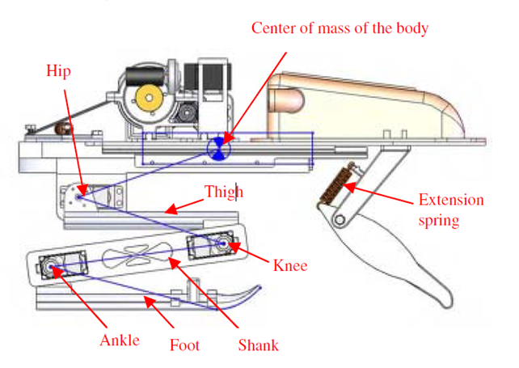
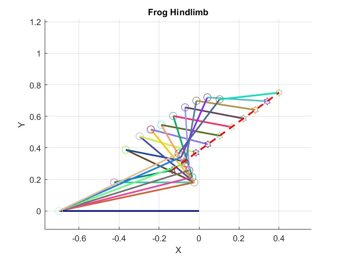

# Frog Jumping Robot Kinematics Simulation

This section provides a detailed overview of the MATLAB script for simulating the kinematics of a jumping robot frog firstly developed by N. Reddy, R. Ray, S. N. Shome [1]. The comprehensive script encompasses both direct and inverse kinematics computations, trajectory generation, and extensive visualization capabilities for a thorough understanding of the robot's movements.

<p align="center">
  
</p>


## Main Kinematics Script (`main.m`)

### Direct Kinematics Validation:

In this section, different poses are computed and visualized to validate the algorithm. The script uses the `Direct_Kin_frog` function, plotting the robot's hindlimb in various configurations. Default initial pose angles are set to `T1=195`, `T2=165`, `T3=195`.

```matlab
clc, clear, close all

% Set to true to enable plotting during computation
plot_trigger = true;

% Validate direct kinematics with different poses
Direct_Kin_frog(plot_trigger, 195, 165, 195);
hold on
Direct_Kin_frog(plot_trigger, 200, 115, 220);
hold on
Direct_Kin_frog(plot_trigger, 205, 95, 235); %*
```

### Inverse Kinematics Validation:

<p align="center">
  
</p>


This part of the script involves generating a desired trajectory and validating the inverse kinematics process. The `Inverse_Kin_frog` function is used to find the joint angles for each point on the trajectory, and the robot's movement is visualized.

```matlab
clc, clear, close all

% Desired trajectory generation
trj = 1; % Select 1 for line, 2 for parabola
final_position = [0.4, 0.75, 0];
path = trajectory_fun(final_position, trj);

% Inverse kinematics validation
for i = 1:length(path)
    plot_trigger = false;
    joint_positions(i, :) = Inverse_Kin_frog(plot_trigger, path(:, i));
end
joint_positions = rad2deg(joint_positions);

% Visualize inverse kinematics path planning
figure('Name', 'Inverse Kinematics Path Planning')
for i = 1:length(joint_positions)
    plot_trigger = true;
    Direct_Kin_frog(plot_trigger, joint_positions(i, 1), joint_positions(i, 2), joint_positions(i, 3));
end
hold on
% Plot the desired trajectory
plot3(path(1, :), path(2, :), path(3, :), '--r', 'LineWidth', 2);
legend off
grid on
```

### Theta over Time Studies:

This part of the script studies joint angles over time during the pre-jumping phase for a line trajectory. It is recommended to increase trajectory points to 100 for better analysis.

```matlab
t = 0:1:99;
plot(t, joint_positions(:, 1), t, joint_positions(:, 2), t, joint_positions(:, 3))
legend('\theta_1', '\theta_2', '\theta_3')
title('Joint Angles during Pre-Jumping Phase (Line Trajectory)')
```

## Direct Kinematics Function (`Direct_Kin_frog`)

The `Direct_Kin_frog` function computes the direct kinematics of the frog robot, providing a detailed visualization of its hindlimb. The function takes initial joint angles (`T1`, `T2`, `T3`) as inputs and uses Denavit-Hartenberg parameters to calculate homogeneous transformation matrices for each joint.

```matlab
function [current_position, T_total] = Direct_Kin_frog(plot, T1, T2, T3)
    % Function implementation...
end
```

## Robot Plotting Function (`frog_plot_fun`)

The `frog_plot_fun` function enhances the visualization by plotting the robot's links and joints in a 3D space. It introduces random colors for links and joints, providing a clear representation of the frog robot's hindlimb.

```matlab
function legend_labels_i = frog_plot_fun(i, dim, prev, x_final, y_final, z_final)
    % Function implementation...
end
```

## Trajectory Generation Function (`trajectory_fun`)

The `trajectory_fun` function generates a trajectory for the frog robot's center of mass movement. It supports both linear and parabolic trajectories based on the desired final position (`final_position`) and trajectory type (`trj`).

```matlab
function path = trajectory_fun(final_position, trj)
    % Function implementation...
end
```

## Inverse Kinematics Function (`Inverse_Kin_frog`)

The `Inverse_Kin_frog` function calculates the joint angles needed to reach a desired position for the robot's center of mass. It utilizes an iterative approach, refining joint positions using the pseudoinverse of the Jacobian matrix while considering specified constraints.

```matlab
function joint_positions = Inverse_Kin_frog(plot, desired_position)
    % Function implementation...
end
```
## Reference

[1] Reddy, N. Srinivasa, Ranjit Ray and Sankar Nath Shome. “Modeling and simulation of a jumping frog robot.” 2011 IEEE International Conference on Mechatronics and Automation (2011): 1264-1268.

## License

This MATLAB script for the frog jumping robot kinematics simulation is released under the [MIT License](LICENSE). Feel free to use, modify, and distribute it as per the terms of the license.
